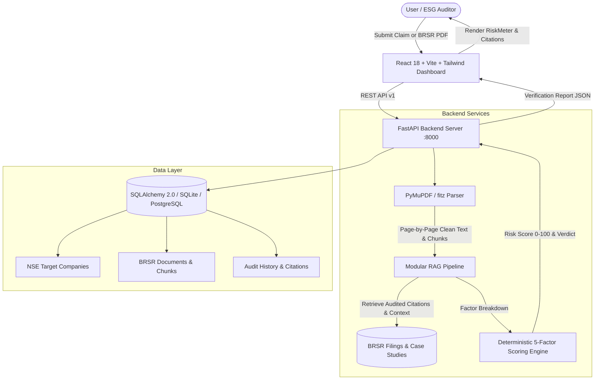

# GreenClaim AI 🌿

> **Evidence-Grounded Greenwashing Detection and Analysis Platform**  
> Built with FastAPI, PyMuPDF, SQLAlchemy, Pydantic v2, React 18, Vite, and Tailwind CSS.

---

## 📌 Executive Summary

Companies frequently publish broad environmental and sustainability assertions (e.g., *"100% carbon-neutral"*, *"zero environmental impact"*, *"fully recyclable"*) that are difficult for investors, regulators, and consumers to verify.

Rather than relying on an unverified LLM black box that can hallucinate facts, **GreenClaim AI** uses **Retrieval-Augmented Generation (RAG)** principles to cross-reference corporate claims directly against statutory **Business Responsibility and Sustainability Reporting (BRSR)** filings mandated by SEBI, **GRI 305** disclosures, and **GHG Protocol** boundaries. Every verdict is backed by page-level citations, quote snippets, and an Explainable AI 5-factor risk scoring matrix.

---

## 🏛️ System Architecture



---

## 🔬 Calibrated 5-Factor Scoring Matrix

The **Greenwashing Risk Score (0–100)** is calculated deterministically across 5 weighted dimensions:

| Factor | Weight | Evaluation Criteria |
| :--- | :---: | :--- |
| **Evidence Strength** | **30%** | Degree to which retrieved statutory disclosures corroborate or refute the claim. |
| **Claim Specificity** | **20%** | Evaluates whether the claim provides quantitative metrics, baseline years, and boundaries vs. vague buzzwords (*"eco-friendly"*, *"pure green"*). |
| **Source Reliability** | **20%** | Distinguishes statutory audited disclosures (SEBI BRSR / GRI) from unverified PR marketing copy. |
| **Contradictory Evidence** | **20%** | Flags direct conflicts with audited emissions (e.g., rising Scope 1/2 emissions, heavy offset reliance). |
| **Missing Information** | **10%** | Penalizes absence of Scope 3 reporting, undefined measurement boundaries, or missing baseline years. |

### Interpretation Bands
- 🟢 **0 – 25**: **Low Risk / Verified** — Fully grounded in statutory disclosures with measurable boundaries.
- 🟡 **26 – 50**: **Moderate Risk / Partially Supported** — Partial alignment; may conflate offset quotas with circularity.
- 🟠 **51 – 75**: **High Risk / Weak Evidence** — Inconclusive disclosures; significant ambiguity or missing data.
- 🔴 **76 – 100**: **Very High Risk / Greenwashing** — Direct operational contradiction with statutory filings.

---

## 🚀 Quickstart & Setup Guide

### Prerequisites
- **Python 3.11+**
- **Node.js 18+** & **npm**

### Method A: Single-Command Launch (Recommended)

From the project root:
```bash
./run_dev.sh
```
This script concurrently boots:
- **FastAPI backend** on `http://localhost:8000`
- **Vite frontend** on `http://localhost:5173`

---

### Method B: Manual Step-by-Step Launch

#### 1. Backend Setup
```bash
# Navigate to backend and install dependencies
cd backend
python3 -m pip install -r requirements.txt

# Run FastAPI development server
python3 -m uvicorn backend.app.main:app --host 0.0.0.0 --port 8000 --reload
```
- API Health Check: [http://localhost:8000/api/v1/health](http://localhost:8000/api/v1/health)
- Interactive Swagger UI: [http://localhost:8000/docs](http://localhost:8000/docs)

#### 2. Frontend Setup
In a new terminal:
```bash
cd frontend
npm install
npm run dev
```
Open [http://localhost:5173](http://localhost:5173) in your browser.

---

## 📊 Live Benchmark Case Studies

The platform comes pre-seeded with 12+ NSE benchmark companies and validated case studies:

### 1. Tata Steel (Slide 10 Case Study)
- **High-Risk Claim**:  
  *"Already carbon-neutral with near-zero Scope 1 emissions across our steel manufacturing facilities."*  
  ➡️ **Result**: **High Risk (Score: ~76–82)**. Audited BRSR Principle 6 filings disclose 26.38 Million MTCO2e in direct emissions; the company has a 2045 net-zero commitment, not present-day neutrality.
- **Verified Rephrase**:  
  *"Has committed to net-zero operations by 2045 with capital allocation for scrap-based EAF transitions."*  
  ➡️ **Result**: **Verified (Score: ~15)**. Supported by audited capital expenditure plans and board-approved transition roadmaps.

### 2. Hindustan Unilever (Packaging)
- **Claim**: *"100% of our plastic packaging is recyclable and plastic-neutral nationwide."*  
  ➡️ **Result**: **Partially Supported (Score: ~46)**. Conflates Extended Producer Responsibility (EPR) volume collection quotas with circular recyclability; multi-layered plastic (MLP) pouches remain non-recyclable in municipal systems.

### 3. NTPC Limited (Energy Mix)
- **Claim**: *"Zero-emission power producer leading India's clean energy transition."*  
  ➡️ **Result**: **High Risk (Score: ~78)**. Statutory filings reveal over 85% of total commercial generation remains pulverized coal power.

---

## 🛠️ API Reference

| Method | Endpoint | Description |
| :--- | :--- | :--- |
| `GET` | `/api/v1/health` | Service health status and RAG engine check. |
| `GET` | `/api/v1/companies` | List all monitored NSE entities with sector information. |
| `POST` | `/api/v1/documents/upload` | Upload PDF report, extract text page-by-page via PyMuPDF, index for RAG. |
| `GET` | `/api/v1/documents` | Retrieve list of ingested documents and extracted page counts. |
| `POST` | `/api/v1/claims/analyze` | Evaluate environmental claim against RAG pipeline and scoring engine. |
| `GET` | `/api/v1/claims/history` | Retrieve audit history with company and category filters. |
| `GET` | `/api/v1/claims/{id}` | Inspect full audit report with page-level citations. |

---

## 🧪 Automated Testing

### Backend Unit & Integration Tests
Run the comprehensive test suite covering the scoring algorithm, RAG pipeline, PyMuPDF extraction, and FastAPI endpoints:
```bash
python3 -m pytest backend/tests/test_backend.py -v
```

### Frontend Build Validation
Verify production bundling and JSX syntax:
```bash
cd frontend
npm run build
```

---

## 🔮 Future Roadmap (IEEE Research Track)

1. **Drop-in Vector Store**: The `BaseRAGPipeline` class in `backend/app/services/rag_stub.py` is architected for a seamless swap to `ChromaDB` or `FAISS` with `SentenceTransformers` (`all-MiniLM-L6-v2`).
2. **Multi-Model Evaluator**: Add automated side-by-side benchmark comparison between No-Retrieval LLM vs RAG-grounded LLM.
3. **Table & Chart OCR**: Integrate PyMuPDF image/vector table extraction for quantitative BRSR ESG annexure parsing.
